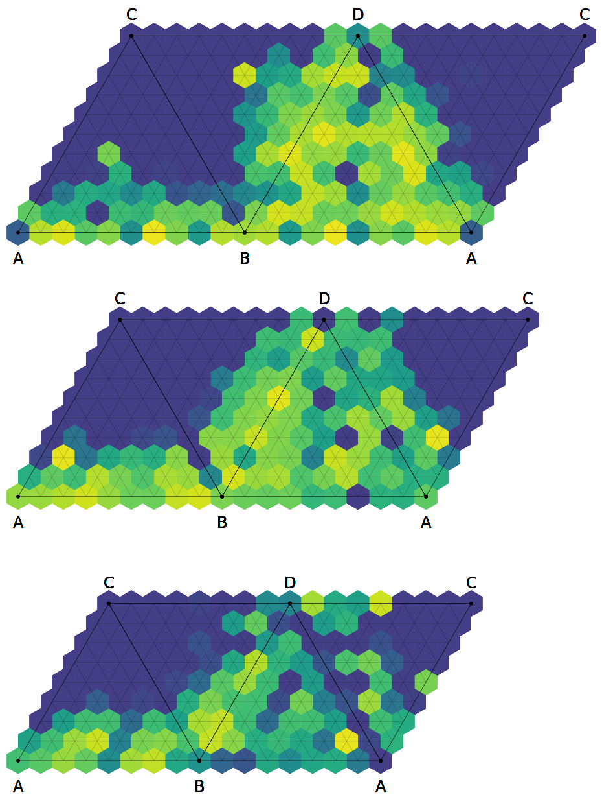

# WIP: Composition Plots

Create ternary and quaternary composition plots with D3.

## API Documentation

The full [__API reference__](https://openchemistry.github.io/composition-plot/composition-plot.html) can be found [here](https://openchemistry.github.io/composition-plot/composition-plot.html).

